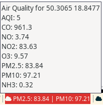

# airquality

Display PM 2.5 and PM 10 on i3bar for coordinates based on data from OpenWeatherMap. After left mouse click show details. If AQI (Air Quality Index) is 3 or more, it's marked as urgent.



## Dependencies

curl, jq, yad

## Instalation

* Copy the `i3blocks.conf` section into your i3blocks configuration or just copy-paste from here:

```
[airquality]
label=
instance=55434
interval=3600
```

* Sign in to OpenWeatherMap and create a new API key (https://home.openweathermap.org/api_keys)
* Copy the `airquality` script into your directory, e.g. ~/.config/i3blocks
* Edit `airquality` file and:
    * paste API key in 3rd line
    * setup coordinates in 4th and 5th lines
* Give it execution permission (chmod +x airquality)

## License

[MIT](https://choosealicense.com/licenses/mit/)